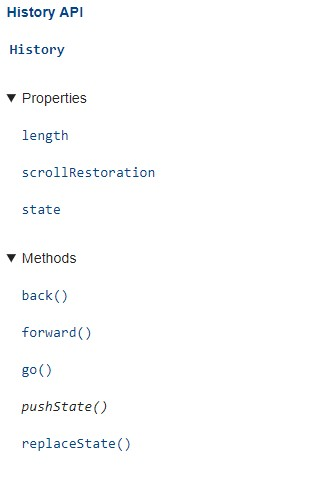

## 기억용 정리
```
 중구난방 어딘가에 또 있을텐데..
```
---

### 컴포넌트 이름 표기법
1. 케밥 표기법 ('my-component') : 정의  
    `<my-component>` : 호출 : 엘리먼트를 호출할때도 반드시 케밥으로 사용
2. 파트칼 표기법 ('MyComponent') : 정의  
    `<MyComponent>` or `<my-component>` : 호출 : 둘다 사용 가능, 단, DOM에 바로 쓸때는 케밥표기법 으로만 가능  

`oe ==> 즉 그냥 통일성 있게 케밥쓰는게 나을듯`

### History API

1. history 객체 (`window.history`) 활용
2. window의 history 프로퍼티는 History 객체를 가리킨다.
3. History 객체 모델은 브라우징 히스토리를 문서와 문서상태 목옥으로 저장한다.
#### history.pushState(state, title, [, url]) // 인자가 3개
`window.history.pushState( null, routes[this.href], this.href )`

1. history.pushState(`state`, title, [, url]) : 인자1  
    - `state` 객체는 자바스크립트 객체이다. pushState를 통해 새로운 history 요소(`entry`)가 생성되는것과 관련되어있다.
    - 사용자가 새로운 `state`를 탐색할때(?), `popstate` 이벤트가 호출된다. 그리고 해당 이벤트의 `state` 프로퍼티는 history 요소의 `state` 객체를 포함하게 된다.
    - `state` 객체는 무엇이든 serialized 될 수 있다. 왜냐면, 파폭은 `state` 객체를 사용자 디스크 환경에 저장하기 때문에 사용자가 브라우저를 재시작 하더라도 복구할 수 있다.
    - 우리는 serialized된 `state` 용량을 2MiB로 제한하고 있다. 만약, 용량이 넘치게 된다면 `pushState()` 메소드에서 예외를 던질것이다. 
    - 너가 만약 `state`관련해 더 많은 공간이 필요하다면 `sessionStorage`나 `localStorage`를 권장한다.
    - 너가 만약 `state`관련해 더 많은 공간이 필요하다면 `sessionStorage`나 `localStorage`를 권장한다.
2. history.pushState(state, `title`, [, url]) : 인자2  
    - 대부분의 브라우저는 해당 인자를 무시한다. (safari 제외하고 거진 다 안된다고 나와있다.)
    - 아마도 미래엔 사용되지 않을까싶다.
    - 빈 문자열을 넘기면 메소드가 바뀌지 않도록 주의해야한다? (Passing the empty string here should be safe against future changes to the method.)
    - 대체적으로 짧은 타이틀(당신이 움직이려 하는 state를 위한)을 넣는다.
    - 변경된 타이틀 정보가 필요하다면, `document.title`을 사용하면 된다.
3.  history.pushState(state, title, `[, url]`) : 인자3(optional) 
    - 브라우저는 pushState()가 실행된 후에 해당 `url`을 로드하도록 시도하지 않는다. 하지만 사용자가 브라우저를 다시 시작한 후에 `url`을 로드하려 할 수 있다.
    - 새로운 `url`정보는 절대경로(?)일 필요가 없다. 만약 상대경로(?)라면 `url`과 `currentUrl`를 비교한다.
    - 새 `url`은 반드시 `currentUrl`과 같은 `origin`을 가지고 있어야한다(?) 다르게 된다면 `pushState()`는 예외를 밷을 것이다.
    - 따로 정의가 되어있지 않으면 현재 문서의 `currntUrl`로 세팅된다.
    -- 

[history.pushState : popstate 이벤트 fired](https://developer.mozilla.org/en-US/docs/Web/API/History/pushState)
```
:: 자세한건 MDN API 문서 찾기
histroy.state // history에 대한 정보를 담고 있음
history.back() // 뒤로 가기 history.go(-1)
history.forward() // 앞으로 가기 history.go(1)
history.go(idx) // 지정한 인덱스 위치로 가기
history.pushState() // 페이지를 리로드 하지 않고 페이지 주소만 변경할 때 사용 - popstate 이벤트가 발생한다. 
history.replaceState // 

:: cf: history 관련 참고 메소드
location : 
```


